# Vaitikan E-Commerce Platform - Database Design Document

---

## 1. Overview

This document provides a comprehensive database design reference for the Vaitikan Shirt Manufacturing E-Commerce Platform. The database is built on **MySQL 8.4+** and managed through **Django ORM**.

### Design Goals
- Support full shirt manufacturing workflow: catalog, inventory, manufacturing, orders, payments (50% advance + 50% before dispatch), customization, complaints
- Normalized to 3NF to avoid data anomalies
- Aligned with real manufacturing business processes
- Enable flexible pricing and stock management

---

## 2. Entity Relationship Diagram (ERD)

```mermaid
erDiagram
    %% ============== USER DOMAIN ==============
    User ||--o{ Address : "has"
    User ||--o{ Cart : "has"
    User ||--o{ Order : "places"
    User ||--o{ Inquiry : "submits"
    User ||--o{ Complaint : "files"
    User ||--o{ Feedback : "gives"
    
    Country ||--o{ State : "contains"
    State ||--o{ City : "contains"
    City ||--o{ PostalCode : "contains"
    PostalCode ||--o{ Address : "referenced_by"
    City ||--o{ Supplier : "located_in"
    
    %% ============== PRODUCT DOMAIN ==============
    Product ||--o{ ProductImage : "has"
    Product ||--o{ ProductVariant : "has"
    
    Fabric ||--o{ ProductVariant : "used_in"
    Color ||--o{ ProductVariant : "used_in"
    Pattern ||--o{ ProductVariant : "used_in"
    Sleeve ||--o{ ProductVariant : "used_in"
    Pocket ||--o{ ProductVariant : "used_in"
    
    ProductVariant ||--o{ VariantSize : "has"
    Size ||--o{ VariantSize : "defines"
    
    VariantSize ||--|| Stock : "has"
    VariantSize ||--o{ ManufacturingSpecification : "requires"
    VariantSize ||--o{ CartItem : "added_to"
    VariantSize ||--o{ OrderItem : "ordered_in"
    VariantSize ||--o{ QuotationRequest : "quoted_for"
    
    %% ============== MANUFACTURING DOMAIN ==============
    MaterialType ||--o{ RawMaterial : "categorizes"
    RawMaterial ||--o{ ManufacturingSpecification : "used_in"
    RawMaterial ||--o{ MaterialSupplier : "supplied_by"
    Supplier ||--o{ MaterialSupplier : "supplies"
    
    %% ============== ORDER DOMAIN ==============
    Cart ||--o{ CartItem : "contains"
    
    Order ||--o{ OrderItem : "contains"
    Order ||--o{ Payment : "has"
    Order ||--o{ Invoice : "generates"
    Order ||--o{ Complaint : "related_to"
    Order ||--o{ Feedback : "receives"
    Address ||--o{ Order : "ships_to"
    
    %% ============== SUPPORT DOMAIN ==============
    Inquiry ||--o{ QuotationRequest : "has"
    QuotationRequest ||--o{ QuotationPrice : "priced_by"

    %% ============== ENTITIES ==============
    User {
        int id PK
        string full_name
        string email UK
        string phone UK
        string user_type
        string account_status
        datetime last_login
    }
    
    Country {
        int id PK
        string country_code UK
        string country_name UK
    }
    
    State {
        int id PK
        int country_id FK
        string state_code
        string state_name
    }
    
    City {
        int id PK
        int state_id FK
        string city_name
    }
    
    PostalCode {
        int id PK
        int city_id FK
        string postal_code UK
        string area_name
    }
    
    Address {
        int id PK
        int user_id FK
        string address_line1
        string address_line2
        int postal_code_id FK
        string address_type
        boolean is_default
    }
    
    Product {
        int id PK
        string product_name
        text description
        datetime created_at
        datetime updated_at
    }
    
    ProductImage {
        int id PK
        int product_id FK
        string image_url
        string alt_text
        boolean is_primary
        int display_order
    }
    
    Fabric {
        int id PK
        string fabric_name UK
    }
    
    Color {
        int id PK
        string color_name UK
        string hex_code
    }
    
    Pattern {
        int id PK
        string pattern_name UK
    }
    
    Sleeve {
        int id PK
        string sleeve_type UK
    }
    
    Pocket {
        int id PK
        string pocket_type UK
    }
    
    Size {
        int id PK
        string size_code UK
        string size_name
        decimal size_markup_percentage
    }
    
    ProductVariant {
        int id PK
        int product_id FK
        int fabric_id FK
        int color_id FK
        int pattern_id FK
        int sleeve_id FK
        int pocket_id FK
        decimal base_price
        string sku UK
    }
    
    VariantSize {
        int id PK
        int variant_id FK
        int size_id FK
        int stock_quantity
    }
    
    Stock {
        int id PK
        int variant_size_id FK,UK
        int quantity_in_stock
        int quantity_reserved
        datetime last_updated
    }
    
    MaterialType {
        int id PK
        string material_type_name UK
        string unit_of_measurement
        text description
    }
    
    Supplier {
        int id PK
        string supplier_name
        string contact_person
        string email
        string phone
        int city_id FK
    }
    
    RawMaterial {
        int id PK
        string material_name
        int material_type_id FK
        decimal unit_price
        decimal current_quantity
        decimal default_reorder_level
    }
    
    MaterialSupplier {
        int id PK
        int material_id FK
        int supplier_id FK
        decimal supplier_price
        decimal min_order_quantity
        decimal reorder_level
        int lead_time_days
        boolean is_preferred
    }
    
    ManufacturingSpecification {
        int id PK
        int variant_size_id FK
        int material_id FK
        decimal quantity_required
    }
    
    Cart {
        int id PK
        int user_id FK
        string status
        string guest_email
        datetime created_at
        datetime updated_at
    }
    
    CartItem {
        int id PK
        int cart_id FK
        int variant_size_id FK
        int quantity
        datetime added_at
    }
    
    Order {
        int id PK
        int user_id FK
        int delivery_address_id FK
        datetime order_date
        datetime expected_delivery_date
        string status
        text notes
    }
    
    OrderItem {
        int id PK
        int order_id FK
        int variant_size_id FK
        int quantity
        decimal snapshot_unit_price
    }
    
    TaxConfiguration {
        int id PK
        string tax_name
        decimal tax_percentage
        date effective_from
        date effective_to
        boolean is_active
    }
    
    Payment {
        int id PK
        int order_id FK
        decimal amount
        string payment_type
        string payment_method
        string payment_status
        string razorpay_order_id
        string razorpay_payment_id
        string razorpay_signature
        string failure_reason
        datetime paid_at
    }
    
    Invoice {
        int id PK
        int order_id FK
        string invoice_number UK
        decimal total_amount
        datetime invoice_date
        string invoice_url
    }
    
    Inquiry {
        int id PK
        int user_id FK
        text inquiry_description
        string logo_file
        datetime inquiry_date
        string status
    }
    
    QuotationRequest {
        int id PK
        int inquiry_id FK
        int variant_size_id FK
        int requested_quantity
        string customization_type
        text customization_details
        string status
    }
    
    QuotationPrice {
        int id PK
        int quotation_id FK
        decimal unit_price
        decimal customization_charge_per_unit
        int quoted_quantity
        datetime valid_from
        datetime valid_until
        string status
    }
    
    Complaint {
        int id PK
        int user_id FK
        int order_id FK
        text complaint_description
        string complaint_category
        string status
        datetime resolution_date
        text resolution_notes
    }
    
    Feedback {
        int id PK
        int user_id FK
        int order_id FK
        int rating
        text feedback_description
        datetime feedback_date
    }
```

---

## 3. Schema Details

### 3.1 User Domain

#### **User** (Custom Authentication Model)
| Field | Data Type | Constraints | Description |
|-------|-----------|-------------|-------------|
| id | BigAutoField | PRIMARY KEY | Auto-incrementing primary key |
| username | VARCHAR(150) | NOT NULL | Django username (required for AbstractUser) |
| full_name | VARCHAR(100) | NOT NULL | User's full name |
| email | VARCHAR(254) | UNIQUE, NOT NULL | Primary login identifier |
| phone | VARCHAR(15) | UNIQUE, NULLABLE | Phone number |
| password | VARCHAR(128) | NOT NULL | Hashed password |
| user_type | VARCHAR(20) | DEFAULT 'customer' | Enum: customer, admin, operator |
| account_status | VARCHAR(20) | DEFAULT 'active' | Enum: active, inactive, suspended |
| last_login | DATETIME | NULLABLE | Last login timestamp |
| is_active | BOOLEAN | DEFAULT True | Django active flag |
| date_joined | DATETIME | AUTO | Account creation timestamp |

#### **Address**
| Field | Data Type | Constraints | Description |
|-------|-----------|-------------|-------------|
| id | BigAutoField | PRIMARY KEY | Auto-incrementing primary key |
| user_id | BigInteger | FOREIGN KEY (User) ON DELETE CASCADE | Address owner |
| address_line1 | VARCHAR(255) | NOT NULL | Street address |
| address_line2 | VARCHAR(255) | NULLABLE | Additional address info |
| postal_code_id | BigInteger | FOREIGN KEY (PostalCode) ON DELETE RESTRICT | Location reference |
| address_type | VARCHAR(20) | DEFAULT 'other' | Enum: home, office, other |
| is_default | BOOLEAN | DEFAULT False | Primary address flag |
| created_at | DATETIME | AUTO | Creation timestamp |

#### **Country, State, City, PostalCode** (Geographic Lookup)
- **Country**: country_code (2-char), country_name (unique)
- **State**: country_id FK, state_code, state_name (unique with country)
- **City**: state_id FK, city_name (unique with state)
- **PostalCode**: city_id FK, postal_code (unique), area_name

---

### 3.2 Product Domain

#### **Product**
| Field | Data Type | Constraints | Description |
|-------|-----------|-------------|-------------|
| id | BigAutoField | PRIMARY KEY | Auto-incrementing primary key |
| product_name | VARCHAR(100) | NOT NULL | Product display name |
| description | TEXT | NULLABLE | Product description |
| created_at | DATETIME | AUTO | Creation timestamp |
| updated_at | DATETIME | AUTO | Last update timestamp |

#### **ProductVariant** (Price Source of Truth)
| Field | Data Type | Constraints | Description |
|-------|-----------|-------------|-------------|
| id | BigAutoField | PRIMARY KEY | Auto-incrementing primary key |
| product_id | BigInteger | FOREIGN KEY (Product) ON DELETE CASCADE | Parent product |
| fabric_id | BigInteger | FOREIGN KEY (Fabric) ON DELETE RESTRICT | Fabric type |
| color_id | BigInteger | FOREIGN KEY (Color) ON DELETE RESTRICT | Color selection |
| pattern_id | BigInteger | FOREIGN KEY (Pattern) ON DELETE RESTRICT | Pattern type |
| sleeve_id | BigInteger | FOREIGN KEY (Sleeve) ON DELETE RESTRICT | Sleeve style |
| pocket_id | BigInteger | FOREIGN KEY (Pocket) ON DELETE RESTRICT | Pocket configuration |
| base_price | DECIMAL(10,2) | NOT NULL | Variant base price |
| sku | VARCHAR(50) | UNIQUE, NULLABLE | Stock keeping unit |
| created_at | DATETIME | AUTO | Creation timestamp |

**Unique Constraint**: (product_id, fabric_id, color_id, pattern_id, sleeve_id, pocket_id)

#### **VariantSize**
| Field | Data Type | Constraints | Description |
|-------|-----------|-------------|-------------|
| id | BigAutoField | PRIMARY KEY | Auto-incrementing primary key |
| variant_id | BigInteger | FOREIGN KEY (ProductVariant) ON DELETE CASCADE | Parent variant |
| size_id | BigInteger | FOREIGN KEY (Size) ON DELETE RESTRICT | Size reference |
| stock_quantity | INTEGER | DEFAULT 0 | Total physical stock |
| created_at | DATETIME | AUTO | Creation timestamp |

**Unique Constraint**: (variant_id, size_id)

#### **Stock** (Inventory Tracking)
| Field | Data Type | Constraints | Description |
|-------|-----------|-------------|-------------|
| id | BigAutoField | PRIMARY KEY | Auto-incrementing primary key |
| variant_size_id | BigInteger | FOREIGN KEY (VariantSize) UNIQUE ON DELETE CASCADE | One-to-one with VariantSize |
| quantity_in_stock | INTEGER | DEFAULT 0 | Available stock count |
| quantity_reserved | INTEGER | DEFAULT 0 | Reserved for pending orders |
| last_updated | DATETIME | AUTO | Last update timestamp |

**Computed Property**: `quantity_available = quantity_in_stock - quantity_reserved`

#### **Attribute Tables** (Fabric, Color, Pattern, Sleeve, Pocket, Size)
All dimension tables follow similar structure:
- **id**: BigAutoField PRIMARY KEY
- **name/type field**: VARCHAR (UNIQUE)
- **Size Special**: size_markup_percentage (DECIMAL) for price adjustment

---

### 3.3 Order Domain

#### **Cart**
| Field | Data Type | Constraints | Description |
|-------|-----------|-------------|-------------|
| id | BigAutoField | PRIMARY KEY | Auto-incrementing primary key |
| user_id | BigInteger | FOREIGN KEY (User) NULLABLE ON DELETE CASCADE | Registered user (nullable for guests) |
| status | VARCHAR(15) | DEFAULT 'active' | Enum: active, checked_out, abandoned |
| guest_email | VARCHAR(254) | NULLABLE | Guest checkout email |
| created_at | DATETIME | AUTO | Creation timestamp |
| updated_at | DATETIME | AUTO | Last update timestamp |

#### **CartItem**
| Field | Data Type | Constraints | Description |
|-------|-----------|-------------|-------------|
| id | BigAutoField | PRIMARY KEY | Auto-incrementing primary key |
| cart_id | BigInteger | FOREIGN KEY (Cart) ON DELETE CASCADE | Parent cart |
| variant_size_id | BigInteger | FOREIGN KEY (VariantSize) ON DELETE RESTRICT | Product being purchased |
| quantity | INTEGER | DEFAULT 1 | Quantity in cart |
| added_at | DATETIME | AUTO | Added timestamp |

**Unique Constraint**: (cart_id, variant_size_id)

#### **Order**
| Field | Data Type | Constraints | Description |
|-------|-----------|-------------|-------------|
| id | BigAutoField | PRIMARY KEY | Auto-incrementing primary key |
| user_id | BigInteger | FOREIGN KEY (User) ON DELETE RESTRICT | Order owner |
| delivery_address_id | BigInteger | FOREIGN KEY (Address) ON DELETE RESTRICT | Shipping address |
| order_date | DATETIME | AUTO | Order placement timestamp |
| expected_delivery_date | DATETIME | NULLABLE | Estimated delivery |
| status | VARCHAR(20) | DEFAULT 'pending' | Order status |
| notes | TEXT | NULLABLE | Customer notes |
| updated_at | DATETIME | AUTO | Last update timestamp |

**Status Values**: pending, confirmed, processing, dispatched, delivered, cancelled

#### **OrderItem**
| Field | Data Type | Constraints | Description |
|-------|-----------|-------------|-------------|
| id | BigAutoField | PRIMARY KEY | Auto-incrementing primary key |
| order_id | BigInteger | FOREIGN KEY (Order) ON DELETE CASCADE | Parent order |
| variant_size_id | BigInteger | FOREIGN KEY (VariantSize) ON DELETE RESTRICT | Product ordered |
| quantity | INTEGER | NOT NULL | Quantity ordered |
| snapshot_unit_price | DECIMAL(10,2) | NOT NULL | Price at time of order (frozen) |
| created_at | DATETIME | AUTO | Creation timestamp |

**Computed Property**: `line_total = quantity * snapshot_unit_price`

---

### 3.4 Finance Domain

#### **Payment** (Multi-Payment per Order)
| Field | Data Type | Constraints | Description |
|-------|-----------|-------------|-------------|
| id | BigAutoField | PRIMARY KEY | Auto-incrementing primary key |
| order_id | BigInteger | FOREIGN KEY (Order) ON DELETE RESTRICT | Associated order |
| amount | DECIMAL(12,2) | NOT NULL | Payment amount |
| payment_type | VARCHAR(10) | NOT NULL | Enum: advance, final, full |
| payment_method | VARCHAR(20) | NOT NULL | Enum: upi, card, netbanking, wallet |
| payment_status | VARCHAR(10) | DEFAULT 'initiated' | Status tracking |
| razorpay_order_id | VARCHAR(100) | NULLABLE | Razorpay order reference |
| razorpay_payment_id | VARCHAR(100) | NULLABLE | Razorpay payment reference |
| razorpay_signature | VARCHAR(255) | NULLABLE | Verification signature |
| failure_reason | VARCHAR(255) | NULLABLE | Failure description |
| paid_at | DATETIME | NULLABLE | Payment completion time |
| created_at | DATETIME | AUTO | Creation timestamp |
| updated_at | DATETIME | AUTO | Update timestamp |

**Status Values**: initiated, pending, success, failed

#### **Invoice**
| Field | Data Type | Constraints | Description |
|-------|-----------|-------------|-------------|
| id | BigAutoField | PRIMARY KEY | Auto-incrementing primary key |
| order_id | BigInteger | FOREIGN KEY (Order) ON DELETE RESTRICT | Associated order |
| invoice_number | VARCHAR(50) | UNIQUE, NOT NULL | Invoice reference number |
| total_amount | DECIMAL(12,2) | NOT NULL | Invoice total |
| invoice_date | DATETIME | AUTO | Invoice generation date |
| invoice_url | VARCHAR(500) | NULLABLE | PDF storage URL |
| created_at | DATETIME | AUTO | Creation timestamp |

#### **TaxConfiguration**
| Field | Data Type | Constraints | Description |
|-------|-----------|-------------|-------------|
| id | BigAutoField | PRIMARY KEY | Auto-incrementing primary key |
| tax_name | VARCHAR(50) | NOT NULL | Tax type (e.g., GST) |
| tax_percentage | DECIMAL(5,2) | NOT NULL | Tax rate |
| effective_from | DATE | NOT NULL | Start date |
| effective_to | DATE | NULLABLE | End date |
| is_active | BOOLEAN | DEFAULT True | Active flag |
| created_at | DATETIME | AUTO | Creation timestamp |

---

### 3.5 Manufacturing Domain

#### **RawMaterial**
| Field | Data Type | Constraints | Description |
|-------|-----------|-------------|-------------|
| id | BigAutoField | PRIMARY KEY | Auto-incrementing primary key |
| material_name | VARCHAR(100) | NOT NULL | Material name |
| material_type_id | BigInteger | FOREIGN KEY (MaterialType) ON DELETE RESTRICT | Material category |
| unit_price | DECIMAL(10,2) | NOT NULL | Price per unit |
| current_quantity | DECIMAL(10,2) | DEFAULT 0 | Available quantity |
| default_reorder_level | DECIMAL(10,2) | NULLABLE | Reorder threshold |
| created_at | DATETIME | AUTO | Creation timestamp |
| last_updated | DATETIME | AUTO | Last update timestamp |

**Unique Constraint**: (material_name, material_type_id)

#### **ManufacturingSpecification** (Bill of Materials)
| Field | Data Type | Constraints | Description |
|-------|-----------|-------------|-------------|
| id | BigAutoField | PRIMARY KEY | Auto-incrementing primary key |
| variant_size_id | BigInteger | FOREIGN KEY (VariantSize) ON DELETE CASCADE | Product variant-size |
| material_id | BigInteger | FOREIGN KEY (RawMaterial) ON DELETE CASCADE | Required material |
| quantity_required | DECIMAL(8,2) | NOT NULL | Required quantity per unit |
| created_at | DATETIME | AUTO | Creation timestamp |

**Unique Constraint**: (variant_size_id, material_id)

---

### 3.6 Support Domain

#### **Inquiry**
| Field | Data Type | Constraints | Description |
|-------|-----------|-------------|-------------|
| id | BigAutoField | PRIMARY KEY | Auto-incrementing primary key |
| user_id | BigInteger | FOREIGN KEY (User) ON DELETE CASCADE | Inquiry submitter |
| inquiry_description | TEXT | NOT NULL | Inquiry details |
| logo_file | CloudinaryField | NULLABLE | Custom logo upload |
| inquiry_date | DATETIME | AUTO | Submission date |
| status | VARCHAR(15) | DEFAULT 'pending' | Enum: pending, reviewed, quoted, accepted |

#### **QuotationRequest**
| Field | Data Type | Constraints | Description |
|-------|-----------|-------------|-------------|
| id | BigAutoField | PRIMARY KEY | Auto-incrementing primary key |
| inquiry_id | BigInteger | FOREIGN KEY (Inquiry) ON DELETE CASCADE | Parent inquiry |
| variant_size_id | BigInteger | FOREIGN KEY (VariantSize) ON DELETE RESTRICT | Requested product |
| requested_quantity | INTEGER | NOT NULL | Bulk quantity |
| customization_type | VARCHAR(100) | NULLABLE | Customization category |
| customization_details | TEXT | NULLABLE | Detailed requirements |
| requested_date | DATETIME | AUTO | Request timestamp |
| status | VARCHAR(15) | DEFAULT 'pending' | Processing status |

#### **Complaint & Feedback**
Standard support models tracking user complaints and order feedback with status management.

---

## 4. Key Relationships

### 4.1 Primary Relationships

| Relationship | Type | Description |
|--------------|------|-------------|
| User → Address | One-to-Many | A user can have multiple addresses |
| User → Order | One-to-Many | A user can place multiple orders |
| Product → ProductVariant | One-to-Many | A product has multiple configuration variants |
| ProductVariant → VariantSize | One-to-Many | A variant is available in multiple sizes |
| VariantSize → Stock | One-to-One | Each variant-size has one stock record |
| Order → OrderItem | One-to-Many | An order contains multiple items |
| Order → Payment | One-to-Many | An order can have multiple payments (advance + final) |
| Inquiry → QuotationRequest | One-to-Many | An inquiry can have multiple quote requests |

### 4.2 Foreign Key Behaviors

| On Delete Behavior | Purpose | Example Tables |
|--------------------|---------|----------------|
| CASCADE | Delete child when parent deleted | OrderItem (Order), CartItem (Cart) |
| RESTRICT | Prevent deletion if referenced | Order (User), Payment (Order) |
| SET_NULL | Set FK to NULL on parent delete | Complaint (Order) |

---

## 5. Indexing Strategy

| Table | Indexed Columns | Purpose |
|-------|-----------------|---------|
| User | email, phone, user_type | Login, lookup, filtering |
| Order | user_id, status | User orders, status filtering |
| Payment | order_id, payment_status, razorpay_order_id | Payment lookup, verification |
| ProductVariant | product_id | Product variants listing |
| Stock | variant_size_id | Stock availability queries |
| RawMaterial | material_type_id | Material filtering |

---

**Document Version**: 1.0  
**Last Updated**: December 2024  
**Database Engine**: MySQL 8.4+  
**ORM**: Django 5.2
