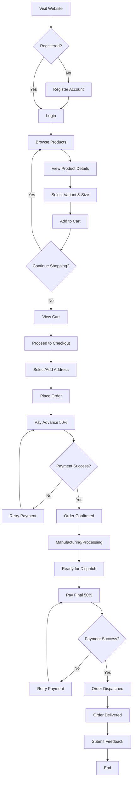
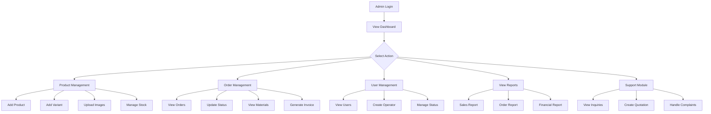
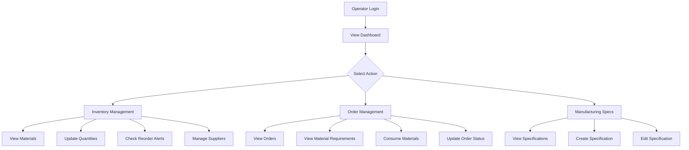
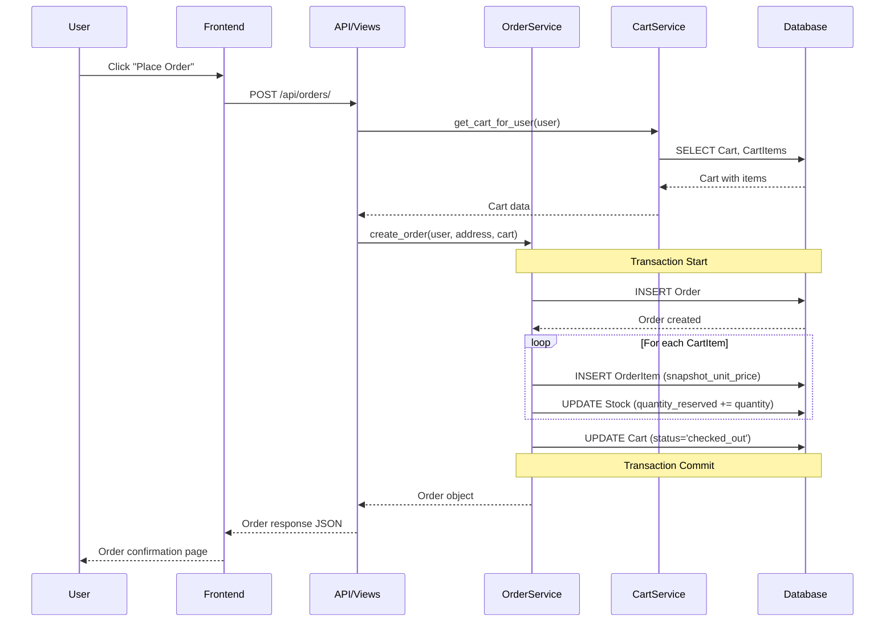
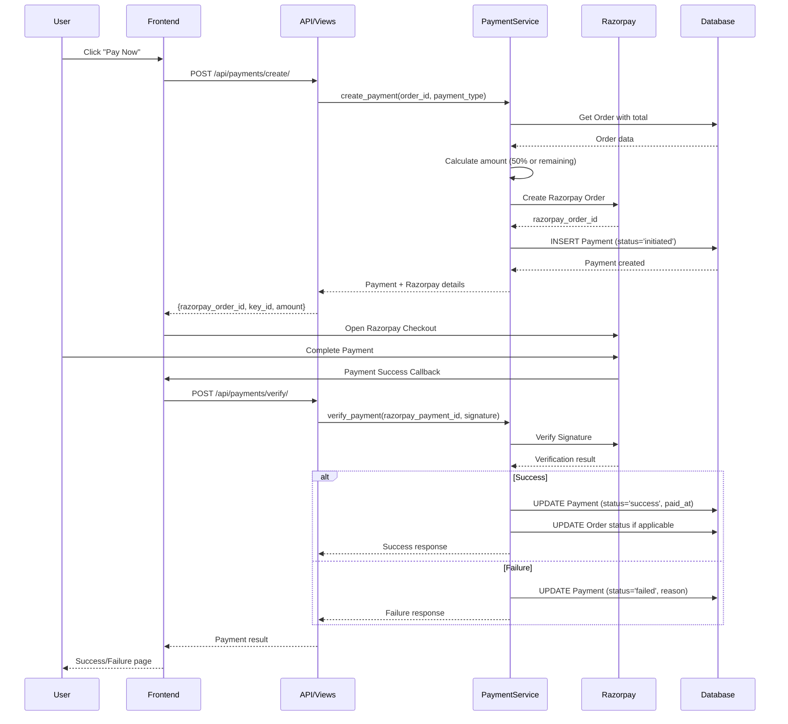
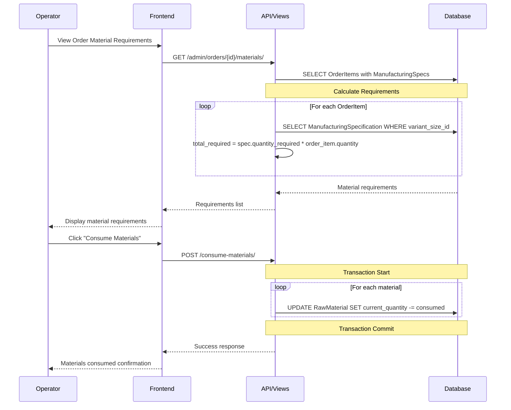
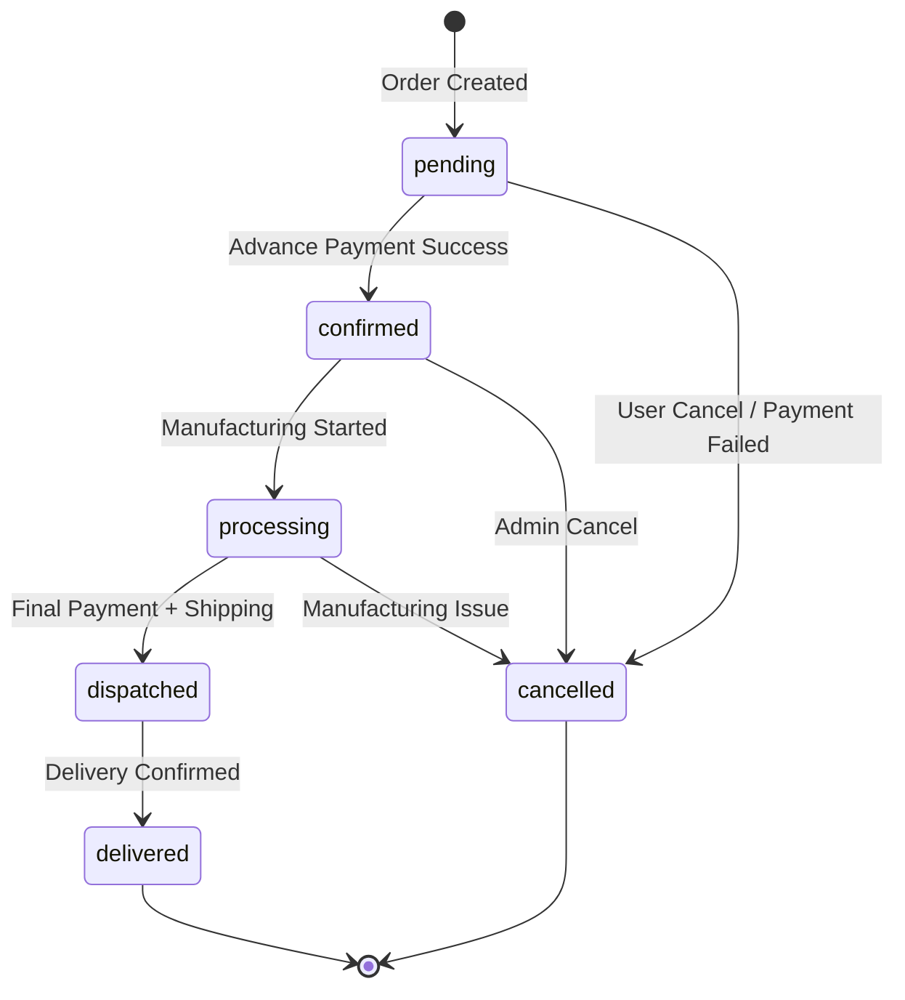
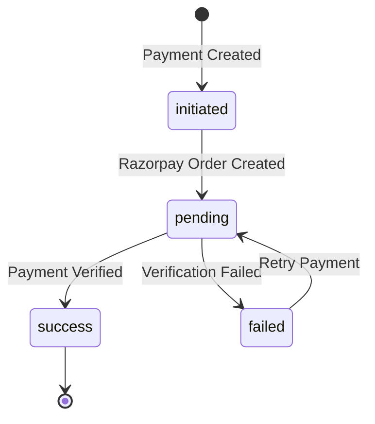
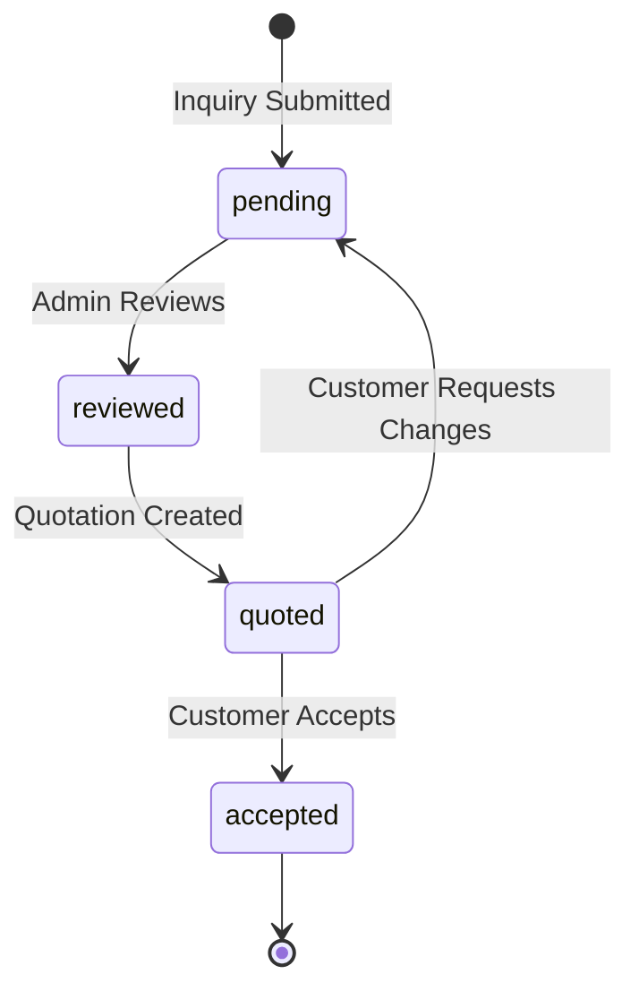

# Vaitikan E-Commerce Platform - Workflow Documentation

---

## 1. Overview

This document describes the user journeys, data flows, and key algorithms implemented in the Vaitikan Shirt Manufacturing E-Commerce Platform.

---

## 2. User Journeys

### 2.1 Customer Journey



#### Step-by-Step Customer Flow:

1. **Registration**
   - User provides: email, full_name, password
   - System creates User record with `user_type='customer'`
   - Password hashed using Django's PBKDF2 algorithm

2. **Login**
   - User submits email and password
   - System validates credentials
   - Returns JWT access token (15 min) and refresh token (7 days)

3. **Product Browsing**
   - User browses product catalog (no auth required)
   - Products displayed with primary image and price range
   - Filtering by fabric, color, pattern, size available

4. **Product Selection**
   - User views product details with all variants
   - Selects specific variant (fabric + color + pattern + sleeve + pocket)
   - Selects size (price adjusts based on size markup)
   - Checks stock availability

5. **Add to Cart**
   - System creates/retrieves active cart for user
   - CartItem created linking cart → variant_size
   - Stock validation performed (quantity ≤ available stock)

6. **Checkout**
   - User reviews cart contents
   - Selects delivery address (or adds new one)
   - Confirms order with optional notes

7. **Order Creation**
   - Cart status changed to 'checked_out'
   - Order record created with status 'pending'
   - OrderItems created with snapshot_unit_price (frozen)
   - Stock reserved: `Stock.quantity_reserved += quantity`

8. **Advance Payment (50%)**
   - Payment record created with `payment_type='advance'`
   - Razorpay order created for 50% of order total
   - User completes payment via Razorpay checkout
   - On success: Order status → 'confirmed'

9. **Manufacturing/Processing**
   - Operator views order material requirements
   - Raw materials consumed from inventory
   - Order status → 'processing'

10. **Final Payment (50%)**
    - When ready for dispatch, final payment triggered
    - Payment record created with `payment_type='final'`
    - User completes remaining 50% payment

11. **Dispatch & Delivery**
    - Order status → 'dispatched'
    - Expected delivery date set
    - Order status → 'delivered' on completion

12. **Feedback**
    - User can submit feedback with rating (1-5)
    - Feedback linked to order record

---

### 2.2 Admin Journey



#### Admin Responsibilities:
1. **Dashboard Access**: View sales metrics, pending orders, low stock alerts
2. **Product Management**: Create products, variants, manage images and pricing
3. **Order Processing**: Update order status through the fulfillment pipeline
4. **User Management**: Create operator accounts, manage user statuses
5. **Reporting**: Generate sales, order, and financial reports
6. **Support**: Handle customer inquiries, create quotations, resolve complaints

---

### 2.3 Operator Journey



#### Operator Responsibilities:
1. **Inventory Tracking**: Monitor raw material quantities, update stock levels
2. **Reorder Management**: Identify materials below reorder level, place orders with suppliers
3. **Material Consumption**: Deduct materials based on order manufacturing requirements
4. **Manufacturing Specs**: Define material requirements per product variant-size

---

## 3. Data Flow Diagrams

### 3.1 Order Creation Data Flow



### 3.2 Payment Processing Data Flow



### 3.3 Material Consumption Data Flow



---

## 4. Key Algorithms

### 4.1 Price Calculation Algorithm

The final price for a product variant-size is calculated using size-based markups:

```python
# Algorithm: Calculate Final Price

def calculate_final_price(variant_size):
    """
    Calculate the final price for a variant-size combination.
    
    Formula: final_price = base_price * (1 + size_markup_percentage / 100)
    
    Args:
        variant_size: VariantSize object containing variant and size references
        
    Returns:
        Decimal: Final price rounded to 2 decimal places
    """
    base_price = variant_size.variant.base_price  # From ProductVariant
    size_markup = variant_size.size.size_markup_percentage  # From Size table
    
    # Apply markup
    markup_multiplier = Decimal('1') + (size_markup / Decimal('100'))
    final_price = base_price * markup_multiplier
    
    return final_price.quantize(Decimal('0.01'))

# Example:
# Base Price: ₹1500.00
# Size: XL with 5% markup
# Final Price: ₹1500 * 1.05 = ₹1575.00
```

### 4.2 Stock Availability Algorithm

```python
# Algorithm: Check and Reserve Stock

def check_and_reserve_stock(variant_size_id, quantity):
    """
    Check stock availability and reserve if sufficient.
    
    Process:
    1. Get stock record for variant_size
    2. Calculate available = in_stock - reserved
    3. If quantity <= available, reserve stock
    4. Else, raise InsufficientStockError
    
    Returns:
        bool: True if reservation successful
    """
    stock = Stock.objects.select_for_update().get(
        variant_size_id=variant_size_id
    )
    
    available = stock.quantity_in_stock - stock.quantity_reserved
    
    if quantity > available:
        raise InsufficientStockError(
            f"Requested {quantity}, only {available} available"
        )
    
    # Reserve stock
    stock.quantity_reserved += quantity
    stock.save()
    
    return True
```

### 4.3 Material Requirements Calculation

```python
# Algorithm: Calculate Order Material Requirements

def calculate_material_requirements(order):
    """
    Calculate total raw material requirements for an order.
    
    Process:
    1. For each order item, get the variant_size
    2. Look up ManufacturingSpecification for that variant_size
    3. Multiply spec.quantity_required by order_item.quantity
    4. Aggregate by material across all items
    
    Returns:
        Dict[material_id, Decimal]: Total quantity required per material
    """
    requirements = defaultdict(Decimal)
    
    for item in order.items.all():
        specifications = ManufacturingSpecification.objects.filter(
            variant_size=item.variant_size
        ).select_related('material', 'material__material_type')
        
        for spec in specifications:
            total_needed = spec.quantity_required * item.quantity
            requirements[spec.material.id] += total_needed
    
    return dict(requirements)

# Example:
# Order: 10 units of "Blue Cotton Shirt - Size M"
# Manufacturing Spec: 
#   - Cotton Fabric: 1.5 meters per unit
#   - Thread: 50 meters per unit
#   - Buttons: 7 per unit
# 
# Result:
#   - Cotton Fabric: 15 meters
#   - Thread: 500 meters
#   - Buttons: 70 units
```

### 4.4 Two-Stage Payment Algorithm

```python
# Algorithm: Payment Staging Logic

def calculate_payment_amount(order, payment_type):
    """
    Calculate payment amount based on payment type and order history.
    
    Business Rule:
    - 'advance': 50% of order total (required at order confirmation)
    - 'final': Remaining 50% (required before dispatch)
    - 'full': 100% (for orders without staged payments)
    
    Args:
        order: Order object
        payment_type: 'advance', 'final', or 'full'
        
    Returns:
        Decimal: Amount to be charged
    """
    total_amount = order.total_amount
    
    # Get successful payments for this order
    paid_amount = Payment.objects.filter(
        order=order,
        payment_status='success'
    ).aggregate(total=Sum('amount'))['total'] or Decimal('0')
    
    if payment_type == 'advance':
        # 50% of total
        return (total_amount * Decimal('0.50')).quantize(Decimal('0.01'))
    
    elif payment_type == 'final':
        # Remaining amount (should be ~50%)
        return (total_amount - paid_amount).quantize(Decimal('0.01'))
    
    elif payment_type == 'full':
        return total_amount
```

### 4.5 Invoice Generation Algorithm

```python
# Algorithm: Invoice Generation

def generate_invoice(order):
    """
    Generate PDF invoice for an order.
    
    Process:
    1. Generate unique invoice number (format: INV-YYYYMMDD-XXXX)
    2. Calculate line items with GST
    3. Generate PDF using ReportLab
    4. Store PDF (Cloudinary/Local)
    5. Create Invoice record
    
    Returns:
        Invoice: Created invoice object
    """
    # Generate unique invoice number
    date_prefix = datetime.now().strftime('%Y%m%d')
    sequence = Invoice.objects.filter(
        invoice_number__startswith=f'INV-{date_prefix}'
    ).count() + 1
    invoice_number = f'INV-{date_prefix}-{sequence:04d}'
    
    # Calculate totals with tax
    subtotal = order.total_amount
    tax_config = TaxConfiguration.objects.filter(
        is_active=True,
        effective_from__lte=date.today()
    ).first()
    
    tax_amount = Decimal('0')
    if tax_config:
        tax_amount = subtotal * (tax_config.tax_percentage / 100)
    
    total_with_tax = subtotal + tax_amount
    
    # Generate PDF
    pdf_buffer = create_invoice_pdf(
        order=order,
        invoice_number=invoice_number,
        subtotal=subtotal,
        tax_amount=tax_amount,
        total=total_with_tax
    )
    
    # Store and create record
    invoice = Invoice.objects.create(
        order=order,
        invoice_number=invoice_number,
        total_amount=total_with_tax,
        invoice_url=store_pdf(pdf_buffer)
    )
    
    return invoice
```

### 4.6 Quotation Pricing Algorithm

```python
# Algorithm: Bulk Quotation Pricing

def calculate_quotation_price(variant_size, quantity, customization_type=None):
    """
    Calculate bulk pricing with quantity discounts and customization charges.
    
    Discount Tiers:
    - 100-499 units: 5% discount
    - 500-999 units: 10% discount
    - 1000+ units: 15% discount
    
    Customization Charges:
    - Logo printing: ₹25 per unit
    - Custom label: ₹15 per unit
    - Embroidery: ₹50 per unit
    """
    base_price = calculate_final_price(variant_size)
    
    # Apply quantity discount
    if quantity >= 1000:
        discount = Decimal('0.15')
    elif quantity >= 500:
        discount = Decimal('0.10')
    elif quantity >= 100:
        discount = Decimal('0.05')
    else:
        discount = Decimal('0')
    
    discounted_price = base_price * (1 - discount)
    
    # Add customization charge
    customization_charges = {
        'logo_printing': Decimal('25.00'),
        'custom_label': Decimal('15.00'),
        'embroidery': Decimal('50.00'),
    }
    
    customization_charge = customization_charges.get(
        customization_type, Decimal('0')
    )
    
    final_unit_price = discounted_price + customization_charge
    
    return {
        'unit_price': final_unit_price,
        'quantity': quantity,
        'customization_charge': customization_charge,
        'total_amount': final_unit_price * quantity
    }
```

---

## 5. State Machines

### 5.1 Order Status State Machine



### 5.2 Payment Status State Machine



### 5.3 Inquiry Status State Machine



---

## 6. Background Processes

### 6.1 Abandoned Cart Cleanup

```python
# Scheduled Task: Clean up abandoned carts

def cleanup_abandoned_carts():
    """
    Mark old inactive carts as abandoned.
    Run daily via cron/celery.
    
    Logic:
    - Carts with status='active'
    - Last updated > 7 days ago
    - Mark as 'abandoned'
    """
    cutoff_date = timezone.now() - timedelta(days=7)
    
    Cart.objects.filter(
        status='active',
        updated_at__lt=cutoff_date
    ).update(status='abandoned')
```

### 6.2 Low Stock Alert

```python
# Scheduled Task: Check for low stock

def check_low_stock_alerts():
    """
    Identify materials below reorder level.
    Send notifications to admin/operators.
    
    Logic:
    - Check RawMaterial.current_quantity vs default_reorder_level
    - Check MaterialSupplier.reorder_level for supplier-specific alerts
    """
    low_stock_materials = RawMaterial.objects.filter(
        current_quantity__lte=F('default_reorder_level')
    )
    
    for material in low_stock_materials:
        send_low_stock_alert(material)
```

---

**Document Version**: 1.0  
**Last Updated**: December 2024  
**Author**: Final Year Project Team
